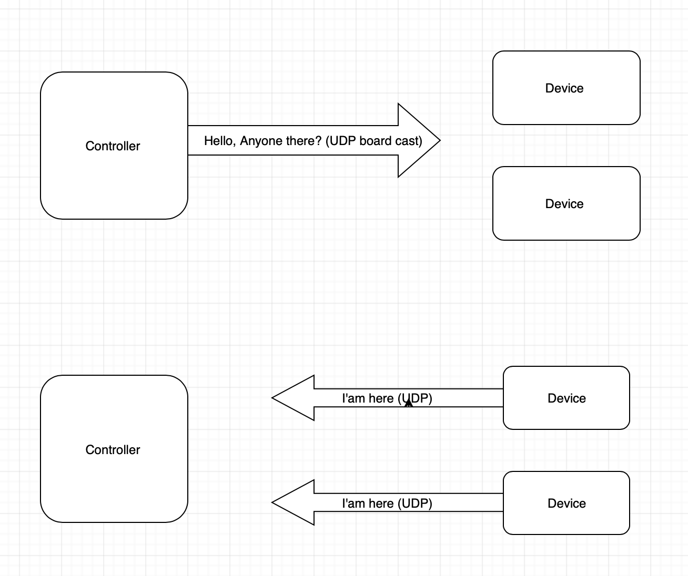
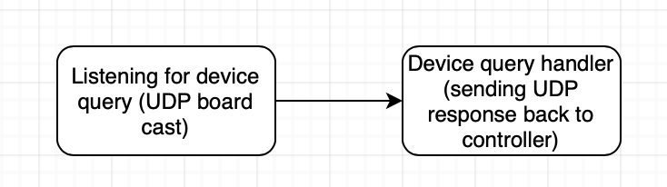
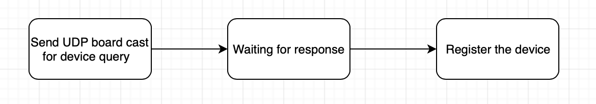
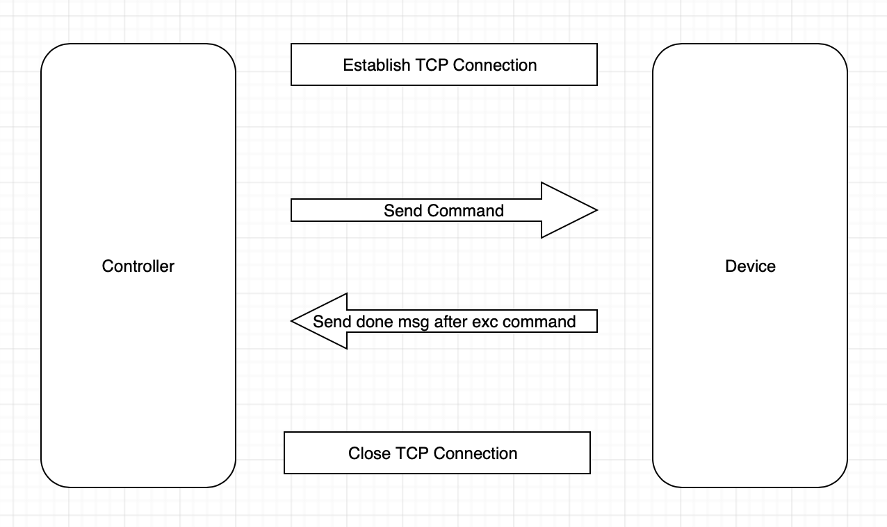
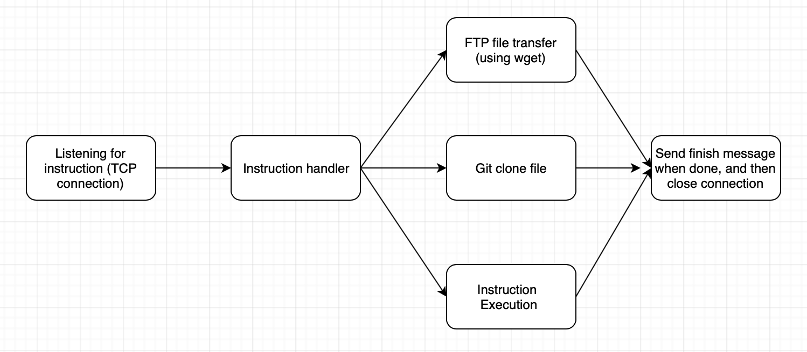
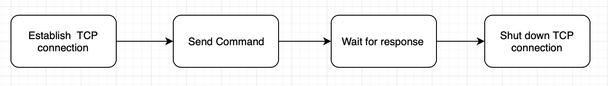
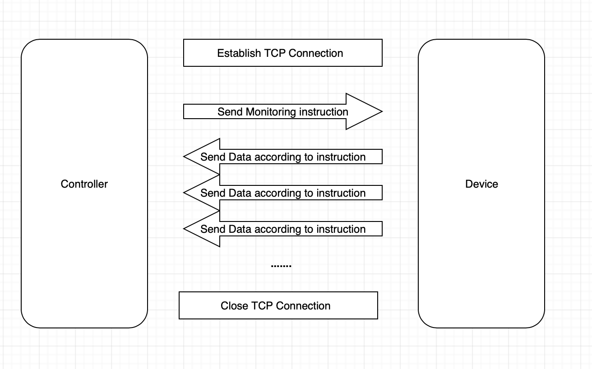
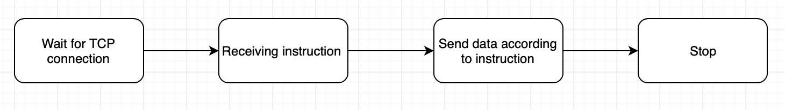
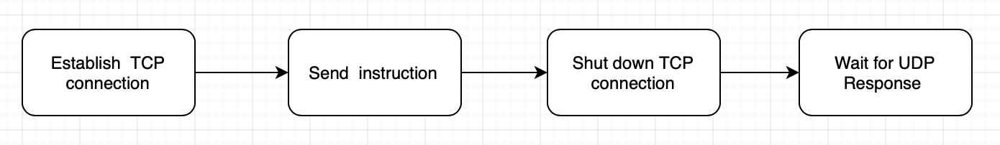

# Device Discovery

####Connection model

​	

#### Device Flow chart

​	

#### Controller Flow Chart

​	

# Command Execution 

####Connection model

​	

#### Device Flow chart

​	

#### Controller Flow Chart

​	

# Status monitoring 

#### Connection Model 

​	

#### Device Flow chart

​	

#### Controller Flow chart

​	